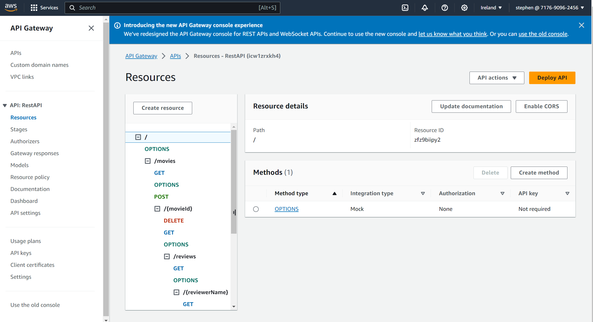

## ServerlessREST Assignment - Distributed Systems.

__Name:__ Stephen Power

This repository contains the implementation of a serverless REST API for the AWS platform. A CDK stack creates the infrastructure. The domain context of the API is movie reviews.

### API endpoints.

[ Provide a bullet-point list of the app's endpoints (excluding the Auth API endpoints).]
e.g.
 
+ POST /movies/reviews - add a movie review.
+ GET /movies/{movieId}/reviews - Get all the reviews for a movie with the specified id.
+ GET /movies/{movieId}/reviews/{reviewerName} - Get the review for the movie with the specified movie ID and written by the named reviewer.
+ GET /movies/reviews/{reviewerName} - Get all the reviews written by a specific reviewer.

